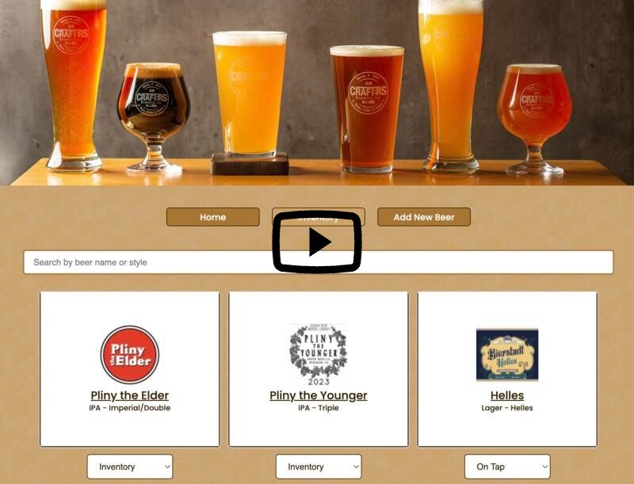

# Brewery Tap List

As a homebrewer living in Denver, Colorado, I visit breweries often. Over the past few years, many breweries have moved from the traditional chalkboard displaying their tap list to applications that display the information dynamically. This brewery tap list application is perfect for any homebrewer who would like to add their own beers to a display board or for brewery owners who need to display a lot of beers and keep track of the rotating lists.

## Walkthrough

## Installation

Fork and clone a copy of the repository Install dependencies by running $ npm install. 

Open the code in your preferred code editor. 

Run $ json-server --watch db.json. Check the command line to see where your local host is running and navigate to this location in your browser.

Open a new terminal and run $ npm start. As db.json is already running on your local host, you may be prompted to run this on another server. Check the command line to see where your local host is running and navigate to this location in your browser.

## Usage

Users initially land on the home page which displays beers currently on tap and beers that are coming soon. Each beer is displayed in a card showing the beer logo, name of the beer, and beer style. Hover over a card to flip the card and show more details, including the brewery and location, description of the beer, and ABV and IBU.

Users can navigate to the inventory page to manage all of the beers in the repository. Users can search through the inventory for beers by name or beer style. On this page, utilize each beer's dropdown menu to move it to 'On Tap,' 'Coming Soon,' or 'X' meaning it is held in inventory but not on top or coming soon. After changing the status of each beer, users can navigate back to the home page to see their new on tap and coming soon lists rendered.

Navigate to the 'Add New Beer' link to add a new beer to the inventory. Once this form in submitted, both the inventory and home page are re-rendered to show the new beer.

## Credits

[Hero beer image](https://unsplash.com/s/photos/beer?orientation=landscape) 

[Favicon](https://www.iconpacks.net/free-icon/beer-1858.html) 

All beer information and label images are pulled from the [Untapped API](https://untappd.com/api/docs)